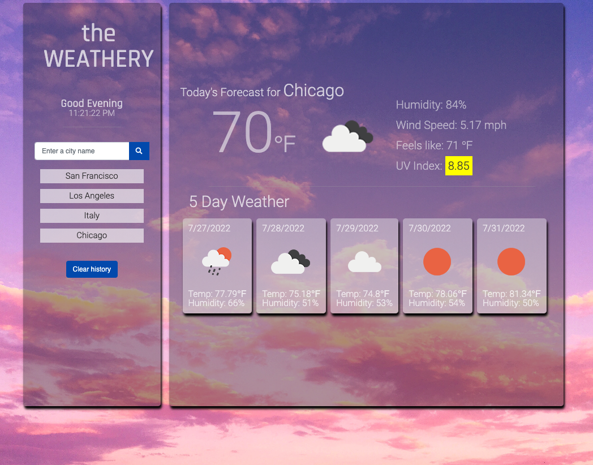
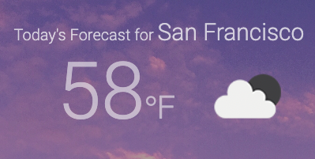
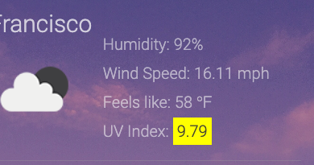
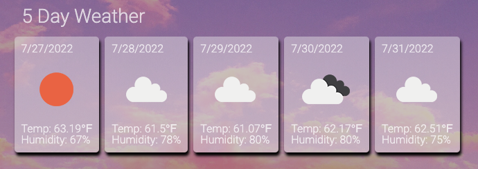

## WEATHER DASHBOARD APPLICATION

Weathery is an app that can show the user weather outlook for multiple cities. 

This application is created utilizing the third-party API's datat and functionality by making request with specific parameters to the URL. API used for this application is <a href="https://openweathermap.org/api/one-call-api">OpenWeather API</a>.

## Accessing the Application

To access the application, you can follow the deployment link or download the source files in the GitHub repository provided below.

<strong>Deployment Link:</strong> <a href="https://itsdenmat.github.io/weather_app/">Weathery App</a>

<strong>GitHub:</strong> <a href="https://github.com/itsDenMat/weather_app">GitHub Weather Dashboard Application</a>

## Application Functionality
* Application will present current and future condition of a certain city searched from the search bar.

* User will be presented with city name, icon representation of weather conditions, and temperature.

* User will be presented with UV index with a color that will indicate whether conditions are favorable, moderate, or severe.

* User will be presented with a 5-day forecast that displays the date, representation of weather conditions, temperature, wind speed, and humidity.

* User will be able to select a city from the search history listed on the left side of the application. This will present the user  the curent and future conditions for the city selected.

